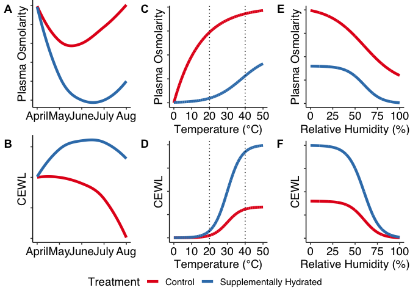
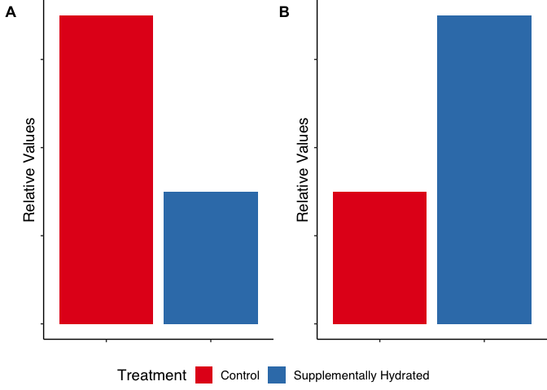

Experimental Hydration Predictions
================
Savannah Weaver

# Packages

``` r
if (!require("tidyverse")) install.packages("tidyverse")
library("tidyverse") # for dplyr workflow of calculations
if (!require("UsingR")) install.packages("UsingR")
library("UsingR") # just need
if (!require("broom")) install.packages("broom")
library("broom") # just need
if (!require("RColorBrewer")) install.packages("RColorBrewer")
library("RColorBrewer") # color scheme
if (!require("hrbrthemes")) install.packages("hrbrthemes")
library("hrbrthemes") # for special ggplot stuff 
if (!require("ggpubr")) install.packages("ggpubr")
library("ggpubr") # for multi-panel plots
```

# Hydrophysiology Over Time Throughout Active Season

## Create FAKE Data

Make very basic data to get at my predictions.

``` r
hydro_active_szn <- data.frame(date = rep(c(10,20,30,40,50), 2),
                               tmt_group = c(rep("Supplementally Hydrated", 5),
                                             rep("Control", 5)),
                               EWL = c(0.7, 0.75, 0.76, 0.76, 0.73, # hydrated
                                       0.7, 0.7, 0.69, 0.67, 0.6), # control
                               bld_osm = c(0, 0, 0, 0.1, 0.1, # hydrated
                                           0, 0.3, 0.4, 0.45, 0.5) # control
                               )

summary(hydro_active_szn)
```

    ##       date     tmt_group              EWL            bld_osm     
    ##  Min.   :10   Length:10          Min.   :0.6000   Min.   :0.000  
    ##  1st Qu.:20   Class :character   1st Qu.:0.6925   1st Qu.:0.000  
    ##  Median :30   Mode  :character   Median :0.7000   Median :0.100  
    ##  Mean   :30                      Mean   :0.7060   Mean   :0.185  
    ##  3rd Qu.:40                      3rd Qu.:0.7450   3rd Qu.:0.375  
    ##  Max.   :50                      Max.   :0.7600   Max.   :0.500

## EWL Plot

``` r
hydro_active_szn %>%
  ggplot(data = .) +
  geom_smooth(aes(x = date,
                  y = EWL,
                  color = tmt_group
                  ),
              formula = y ~ x,
              method = "loess",
              span = 1,
              se = F, 
              size = 1.6, 
              alpha = 1
              ) +
  scale_colour_brewer(name = "Treatment",
                        #labels = c("Control", "Hydrated"),
                        palette = "Set1"
                        ) +
  theme_classic() + 
  scale_x_continuous(breaks = seq(from = 10, to = 50, by=10),
                     labels = c("April", "May", "June", "July", "Aug"),
                     limits = c(10,50)
                     ) +
  xlab("") +
  ylab("CEWL") +
  theme(plot.margin = unit(c(0,0.5,0,1.5), "lines"), # buffer for ggarrange labels
        text = element_text(color = "black", 
                            family = "sans",
                            size = 14),
        axis.text = element_text(color = "black", 
                            family = "sans",
                            size = 14),
        legend.text.align = 0,
        #axis.text.x = element_blank(),
        axis.text.y = element_blank(),
        legend.position = "bottom" # put legend inside plot at this point
        ) -> szn_EWL_plot
```

*I predict that lizard EWL will change throughout the active season,
starting at the same level for both treatment groups, then diverging as
they receive supplemental hydration or not. Supplementally hydrated
lizards will be able to increase EWL for evaporative cooling at the
summer gets hotter, but control lizards will not. Both groups will
decrease EWL as their environment gets drier in the late summer, making
lizards increasingly water stressed. Throughout the active season,
supplementally hydrated lizards will be able to maintain much higher EWL
compared to control lizards, regardless of environmental effects.*

## Blood Osmolarity Plot

``` r
hydro_active_szn %>%
  ggplot(data = .) +
  geom_smooth(aes(x = date,
                  y = bld_osm,
                  color = tmt_group
                  ),
              formula = y ~ x,
              method = "loess",
              span = 1,
              se = F, 
              size = 1.6, 
              alpha = 1
              ) +
  scale_colour_brewer(name = "Treatment",
                        #labels = c("Control", "Hydrated"),
                        palette = "Set1"
                        ) +
  theme_classic() + 
  scale_x_continuous(breaks = seq(from = 10, to = 50, by=10),
                     labels = c("April", "May", "June", "July", "Aug"),
                     limits = c(10,50)
                     ) +
  xlab("") +
  ylab("Plasma Osmolarity") +
  theme(plot.margin = unit(c(0,0.5,0,1.5), "lines"), # buffer for ggarrange labels
        text = element_text(color = "black", 
                            family = "sans",
                            size = 14),
        axis.text = element_text(color = "black", 
                            family = "sans",
                            size = 14),
        legend.text.align = 0,
        #axis.text.x = element_blank(),
        axis.text.y = element_blank(),
        legend.position = "bottom" # put legend inside plot at this point
        ) -> szn_bldosm_plot1
```

*I predict that supplementally hydrated lizards will be able to maintain
lower blood osmolarity (higher body water content) compared to control
lizards throughout the active season. Both groups will start the active
season with the same, low blood osmolarity, then diverge as hydrated
lizards are able to maintain the same low blood osmolarity while control
lizard blood osmolarity increases as the environment gets hotter and
drier. Hydrated lizards will also increase in blood osmolarity in the
hot, dry late-summer, but they will still maintain much lower blood
osmolarity with that increase.*

Alternatively, the groups may relate in the same way, but they may start
with high blood osmolarity after hibernation, as suggested by mass loss
measured in estivating lizards in Kearney et al. 2018 “field tests”.

Add that idea in fake data:

``` r
alt <- hydro_active_szn %>%
  mutate(bld_osm2 = c(0.5, 0.1, 0, 0, 0.1, # hydrated
                      0.5, 0.3, 0.3, 0.4, 0.5)) # control)
```

plot:

``` r
alt %>%
  ggplot(data = .) +
  geom_smooth(aes(x = date,
                  y = bld_osm2,
                  color = tmt_group
                  ),
              formula = y ~ x,
              method = "loess",
              span = 1,
              se = F, 
              size = 1.6, 
              alpha = 1
              ) +
  scale_colour_brewer(name = "Treatment",
                        #labels = c("Control", "Hydrated"),
                        palette = "Set1"
                        ) +
  theme_classic() + 
  scale_x_continuous(breaks = seq(from = 10, to = 50, by=10),
                     labels = c("April", "May", "June", "July", "Aug"),
                     limits = c(10,50)
                     ) +
  xlab("") +
  ylab("Plasma Osmolarity") +
  theme(plot.margin = unit(c(0,0.5,0,1.5), "lines"), # buffer for ggarrange labels
        text = element_text(color = "black", 
                            family = "sans",
                            size = 14),
        axis.text = element_text(color = "black", 
                            family = "sans",
                            size = 14),
        legend.text.align = 0,
        #axis.text.x = element_blank(),
        axis.text.y = element_blank(),
        legend.position = "bottom" # put legend inside plot at this point
        ) -> szn_bldosm_plot2
```

# Temperature Effects on Hydrophysiology

## Create FAKE Data

Fake, predicted relationship between EWL \~ temperature:

``` r
# make predicted data for EWL ~ temp for supplementally hydrated lizards
temp_EWL_supp <- data.frame(temp = c(seq(0, 50, by = 0.01))) %>%
  mutate(relative_EWL = 0.1/(1+exp((-temp+30)/4)),
         tmt_group = rep("Supplementally Hydrated", nrow(.)))
# make predicted data for EWL ~ temp for CONTROL lizards
temp_EWL_control <- data.frame(temp = c(seq(0, 50, by = 0.01))) %>%
  mutate(relative_EWL = (0.1/(1+exp((-temp+30)/4))/3),
         tmt_group = rep("Control", nrow(.)))
# put into one dataframe
temp_EWL <- rbind(temp_EWL_supp, temp_EWL_control)
```

Fake, predicted relationship between blood osmolarity \~ temperature:

``` r
# supplementally hydrated lizards
temp_osmol_supp <- data.frame(temp = c(seq(0, 50, by = 0.01))) %>%
  mutate(relative_osmol = 0.5/(1+exp((-temp+38)/8)),
         tmt_group = rep("Supplementally Hydrated", nrow(.)))
# CONTROL lizards
temp_osmol_control <- data.frame(temp = c(seq(0, 50, by = 0.01))) %>%
  mutate(relative_osmol = 1-exp((-temp)/15),
         tmt_group = rep("Control", nrow(.)))
# put into one dataframe
temp_osmol <- rbind(temp_osmol_supp, temp_osmol_control)
```

## EWL Effects Plot

``` r
temp_EWL %>%
  ggplot(data = .) +
  geom_line(aes(x = temp,
                  y = relative_EWL,
                  color = tmt_group
                  ),
              size = 1.6, 
              alpha = 1
              ) +
  scale_colour_brewer(name = "Treatment",
                        palette = "Set1"
                        ) +
  theme_classic() + 
  geom_vline(xintercept = c(20, 40),
             linetype = "dotted"
             ) +
  xlab("Temperature (°C)") +
  ylab("CEWL") +
  theme(plot.margin = unit(c(0.5,0.5,0,1.5), "lines"), # buffer for ggarrange labels
        text = element_text(color = "black", 
                            family = "sans",
                            size = 14),
        axis.text = element_text(color = "black", 
                            family = "sans",
                            size = 14),
        legend.text.align = 0,
        #axis.text.x = element_blank(),
        axis.text.y = element_blank(),
        legend.position = "bottom" # put legend inside plot at this point
        ) -> temp_EWL_plot
```

*I predict that as temperature increases, EWL will increase sigmoidally.
At extremely low temperatures, EWL levels-off because lizards do not
need evaporative cooling and want to conserve water, so after a certain
threshold, they will no longer lose water via EWL. Alternatively, at
extremely high temperatures, EWL will level-off because evaporative
cooling will be at its maximum rate. As temperatures continue to rise,
lizards would undoubtedly begin to reach their thermal maximum and/or
run out of water for evaporative cooling, potentially leading to a drop
in EWL at the highest temperatures. Also note, I doubt we will collect
data that fully elucidates this curve. The vertical dashed lines
delineate the expected observational range.*

## Blood Osmolarity Effects Plot

``` r
temp_osmol %>%
  ggplot(data = .) +
  geom_line(aes(x = temp,
                  y = relative_osmol,
                  color = tmt_group
                  ),
              size = 1.6, 
              alpha = 1
              ) +
  scale_colour_brewer(name = "Treatment",
                        palette = "Set1"
                        ) +
  theme_classic() + 
  geom_vline(xintercept = c(20, 40),
             linetype = "dotted"
             ) +
  xlab("Temperature (°C)") +
  ylab("Plasma Osmolarity") +
  theme(plot.margin = unit(c(0.5,0.5,0,1.5), "lines"), # buffer for ggarrange labels
        text = element_text(color = "black", 
                            family = "sans",
                            size = 14),
        axis.text = element_text(color = "black", 
                            family = "sans",
                            size = 14),
        legend.text.align = 0,
        #axis.text.x = element_blank(),
        axis.text.y = element_blank(),
        legend.position = "bottom" # put legend inside plot at this point
        ) -> temp_bldosm_plot
```

*I predict that as temperature increases, blood osmolarity for both
supplementally hydrated and control lizards will increase. However,
supplementally hydrated lizards will maintain lower blood osmolarity
across a wider temperature range, only increasing when extremely high
temperatures drive them to become water-stressed, while the control
lizards will increase blood osmolarity at a very low temperature because
they don’t have water reserves. The diurnal temperature range we are
actually likely to measure is between the two dotted lines.*

# Humidity Effects on Hydrophysiology

## Create FAKE Data

Fake, predicted relationship between EWL \~ temperature:

``` r
# make predicted data for EWL ~ RH for supplementally hydrated lizards
RH_EWL_supp <- data.frame(RH = c(seq(0, 100, by = 0.1))) %>%
  mutate(relative_EWL = 0.1/(1+exp((RH-60)/9)),
         tmt_group = rep("Supplementally Hydrated", nrow(.)))
# make predicted data for EWL ~ RH for CONTROL lizards
RH_EWL_control <- data.frame(RH = c(seq(0, 100, by = 0.1))) %>%
  mutate(relative_EWL = 0.1/(1+exp((RH-60)/9))/2.5,
         tmt_group = rep("Control", nrow(.)))
# put into one dataframe
RH_EWL <- rbind(RH_EWL_supp, RH_EWL_control)
```

Fake, predicted relationship between blood osmolarity \~ temperature:

``` r
# supplementally hydrated lizards
RH_osmol_supp <- data.frame(RH = c(seq(0, 100, by = 0.1))) %>%
  mutate(relative_osmol = 0.1/(1+exp((RH-60)/10))/2.5, #still working on
         tmt_group = rep("Supplementally Hydrated", nrow(.)))
# CONTROL lizards
RH_osmol_control <- data.frame(RH = c(seq(0, 100, by = 0.1))) %>%
  mutate(relative_osmol = (0.1/(1+exp((RH-60)/20))/1.2) + 0.02, # tbd
         tmt_group = rep("Control", nrow(.)))
# put into one dataframe
RH_osmol <- rbind(RH_osmol_supp, RH_osmol_control)
```

## EWL Effects Plot

``` r
RH_EWL %>%
  ggplot(data = .) +
  geom_line(aes(x = RH,
                  y = relative_EWL,
                  color = tmt_group
                  ),
              size = 1.6, 
              alpha = 1
              ) +
  scale_colour_brewer(name = "Treatment",
                        palette = "Set1"
                        ) +
  theme_classic() + 
  xlab("Relative Humidity (%)") +
  ylab("CEWL") +
  theme(plot.margin = unit(c(0.5,0.5,0,1.5), "lines"), # buffer for ggarrange labels
        text = element_text(color = "black", 
                            family = "sans",
                            size = 14),
        axis.text = element_text(color = "black", 
                            family = "sans",
                            size = 14),
        legend.text.align = 0,
        #axis.text.x = element_blank(),
        axis.text.y = element_blank(),
        legend.position = "bottom" # put legend inside plot at this point
        ) -> RH_EWL_plot
```

*I predict that as relative humidity increases, we will see a decrease
in EWL for both treatment groups due to a decreasing vapor pressure
differential between individuals and their environment. At lower RH, the
supplementally hydrated lizards will have a much greater capacity for
EWL, and I predict that’s what we will observe. At both high and low RH,
I predict that EWL will level-off because at certain low and high
thresholds, further changes in RH are unlikely to drive changes in EWL.
We expect to observe the full range of RH at our field site throughout
the summer.*

## Blood Osmolarity Effects Plot

``` r
RH_osmol %>%
  ggplot(data = .) +
  geom_line(aes(x = RH,
                  y = relative_osmol,
                  color = tmt_group
                  ),
              size = 1.6, 
              alpha = 1
              ) +
  scale_colour_brewer(name = "Treatment",
                        palette = "Set1"
                        ) +
  theme_classic() + 
  xlab("Relative Humidity (%)") +
  ylab("Plasma Osmolarity") +
  theme(plot.margin = unit(c(0.5,0.5,0,1.5), "lines"), # buffer for ggarrange labels
        text = element_text(color = "black", 
                            family = "sans",
                            size = 14),
        axis.text = element_text(color = "black", 
                            family = "sans",
                            size = 14),
        legend.text.align = 0,
        #axis.text.x = element_blank(),
        axis.text.y = element_blank(),
        legend.position = "bottom" # put legend inside plot at this point
        ) -> RH_bldosm_plot
```

*I predict that lizards will be able to maintain lower blood osmolarity
at higher environmental RH because they will be losing less water from
EWL. Supplementally hydrated lizards will be able to maintain lower
blood osmolarity across RH regardless, and RH will have less of an
effect on their ability to maintain low blood osmolarity. Conversely,
control lizards will have much higher blood osmolarity and RH will have
a larger effect on their ability to maintain a certain blood
osmolarity.*

# Hydration Treatment Effects on Behavior, Physiology, Fitness

## Create FAKE Data

I predict that hydrated = move more spend more time in open microhabitat
less time in burrow refugia, begin estivation later in the summer, have
larger home ranges, higher Tset better db higher EWL better body
condition more clutches more eggs/clutch bigger eggs

``` r
# treatment groups
tmt <- c("Control", "Supplementally Hydrated")

# movement, time aboveground, home range
# Tset, EWL, BCI, #clutches, #eggs, egg size
H_greater <- c(3,7)
# db and blood osmolarity would be reverse relationship

# compile 
tmt_pred_dat <- data.frame(Treatment = as.factor(tmt),
                           resp = H_greater
                           )
```

## Hydrated \> Control Bar Graph

``` r
tmt_pred_dat %>%
  ggplot(data = .) +
  geom_bar(aes(x = Treatment,
               y = resp,
               fill = Treatment
                  ),
           stat = "identity"
              ) +
  scale_fill_brewer(name = "Treatment",
                        #labels = c("Control", "Hydrated"),
                        palette = "Set1"
                        ) +
  theme_classic() + 
  xlab("") +
  ylab("Relative Values") +
  theme(plot.margin = unit(c(0,0,0,1.5), "lines"), # buffer for ggarrange labels
        text = element_text(color = "black", 
                            family = "sans",
                            size = 14),
        axis.text = element_text(color = "black", 
                            family = "sans",
                            size = 14),
        legend.text.align = 0,
        axis.text.x = element_blank(),
        axis.text.y = element_blank(),
        legend.position = "none" # put legend inside plot at this point
        ) -> hyd_con_bar
```

## Control \> Hydrated Bar Graph

``` r
tmt_pred_dat %>%
  ggplot(data = .) +
  geom_bar(aes(x = Treatment,
               y = rev(resp),
               fill = Treatment
                  ),
           stat = "identity"
              ) +
  scale_fill_brewer(name = "Treatment",
                        #labels = c("Control", "Hydrated"),
                        palette = "Set1"
                        ) +
  theme_classic() + 
  xlab("") +
  ylab("Relative Values") +
  theme(plot.margin = unit(c(0,0,0,1.5), "lines"), # buffer for ggarrange labels
        text = element_text(color = "black", 
                            family = "sans",
                            size = 14),
        axis.text = element_text(color = "black", 
                            family = "sans",
                            size = 14),
        legend.text.align = 0,
        axis.text.x = element_blank(),
        axis.text.y = element_blank(),
        legend.position = "none" # put legend inside plot at this point
        ) -> con_hyd_bar
```

# Put Plots Together

line graphs:

``` r
# arrange together
all <- ggpubr::ggarrange(szn_bldosm_plot2, temp_bldosm_plot, RH_bldosm_plot,
                          szn_EWL_plot, temp_EWL_plot, RH_EWL_plot,
                          labels = c("A", "C", "E", "B", "D", "F"),
                          #hjust = 0.2,
                          #vjust = 1,
                          ncol = 3, nrow = 2,
                          widths = c(2,2,2),
                          common.legend = T,
                          legend = "bottom"
                           )

# view
all
```

<!-- -->

``` r
# export
ggsave(filename = "exp_predicts_lines.tiff",
       plot = all,
       path = ".",
       device = "tiff",
       width = 20, height = 12, 
       units = "cm")
```

bar graphs:

``` r
# arrange together
both <- ggpubr::ggarrange(con_hyd_bar, hyd_con_bar,
                          labels = c("A", "B"),
                          #hjust = 0.2,
                          #vjust = 1,
                          ncol = 2, nrow = 1,
                          widths = c(1.5,1.5),
                          common.legend = T,
                          legend = "bottom"
                           )

# view
both
```

<!-- -->

``` r
# export
ggsave(filename = "exp_predicts_bars.tiff",
       plot = both,
       path = ".",
       device = "tiff",
       width = 12, height = 6, 
       units = "cm")
```
